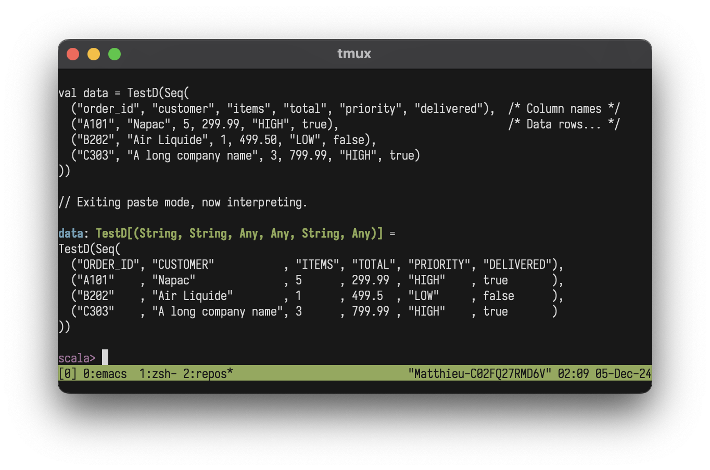

<p align="center">
  
</p>

# testd (𝛼)
**Spark test data - made clean + simple**

A lightweight Scala [quoted-DSL](https://homepages.inf.ed.ac.uk/wadler/papers/qdsl/qdsl.pdf) for Spark test data generation. 🚧 (𝛼): the API is fledgling and may change with feedback.
## Features
- Turns messy data -> ✨🍰 pretty, spreadsheet-like data-as-code
- Drop **TestD.scala** in any Spark project like a header file
- Lets Spark casting do the heavy lifting
- Move from REPL to unit tests for TDD style ETL


Want to try? Just load it in your spark-shell:
```bash
curl -Ls raw.githubusercontent.com/mattlianje/testd/master/TestData.scala > TestData.temp.scala && spark-shell -i TestData.temp.scala
```

## Get started
You just need to know 4 things:
1. The first row of a **TestD** is for column names
```scala
val data = TestD(Seq(
  ("order_id", "customer", "items", "total", "priority", "delivered"),  /* Column names */
  ("A101", "Napac", 5, 299.99, "HIGH", true),                           /* Data rows... */
  ("B202", "Air Liquide", 1, 499.50, "LOW", false),
  ("C303", "A long company name", 3, 799.99, "HIGH", true)
))
```
2. Call `toDf`on a **TestD** to get a Spark DataFrame
```scala
val df = data.toDf(spark)
```
3. Call `println` on a **TestD** to get a ✨🍰 pretty **TestD**
```scala
println(data)                    
/*
TestD(Seq(
     ("ORDER_ID", "CUSTOMER"           , "ITEMS", "TOTAL", "PRIORITY", "DELIVERED"),
     ("A101"    , "Napac"              , 5      , 299.99 , "HIGH"    , true       ),
     ("B202"    , "Air Liqide"         , 1      , 499.50 , "LOW"     , false      ),
     ("C303"    , "A long company name", 3      , 799.99 , "HIGH"    , true       )
   ))
*/
```
4. Use the 3 **TestD** schema operations below.

## Schema Operations
There are 3 building blocks with **TestD** casting: `castMatchingColumns`, `conformToSchema`, `filterToSchema`

Imagine ...
- We create a quick and messy DataFrame:
```scala
val messyDf = spark.createDataFrame(Seq(
  ("1", "2023-01-01", "99.9", "true"),
  ("2", "20230102", "88.8", "1"),
  ("3", "2023/01/03", "77.7", "FALSE")
)).toDF("ID", "DATE", "AMOUNT", "ACTIVE")
```

- But, like often, we have a target schema with nice types:
```scala
val schema = StructType(Seq(
  StructField("id", IntegerType),
  StructField("date", DateType),
  StructField("amount", DoubleType),
  StructField("active", BooleanType),
  StructField("category", StringType)
))
```

#### `castMatchingColumns`
   
Cast DataFrame columns if they exist in schema, preserves structure:
```scala
val castedDf = TestD.castMatchingColumns(messyDf, schema)
castedDf.show()
+---+----------+------+-------+
| ID|      DATE|AMOUNT|ACTIVE |
+---+----------+------+-------+
|  1|2023-01-01|  99.9|  true |
|  2|2023-01-02|  88.8|  true |
|  3|2023-01-03|  77.7| false |
+---+----------+------+-------+
```

#### `conformToSchema`
   
Makes DataFrame match exactly - handles missing/extra columns:
```scala
val conformedDf = TestD.conformToSchema(messyDf, schema)
conformedDf.show()
+---+----------+------+-------+--------+
| id|      date|amount|active |category|
+---+----------+------+-------+--------+
|  1|2023-01-01|  99.9|  true |    null|
|  2|2023-01-02|  88.8|  true |    null|
|  3|2023-01-03|  77.7| false |    null|
+---+----------+------+-------+--------+
```

#### `filterToSchema`
   
Keeps only DataDrame columns if names exist in schema

```scala
val extraDf = messyDf.withColumn("EXTRA", lit("unwanted"))
val filteredDf = TestD.filterToSchema(extraDf, schema)
filteredDf.show()
+---+----------+------+-------+
| id|      date|amount|active |
+---+----------+------+-------+
|  1|2023-01-01|  99.9|  true |
|  2|2023-01-02|  88.8|  true |
|  3|2023-01-03|  77.7| false |
+---+----------+------+-------+
```


## More examples
- Generate nested data and avoid boilerplate with Scala collections
```scala
val products = for {
  category <- List("Electronics", "Books", "Games")
  id <- 1 to 3
  price = id * 10.99
  inStock = id % 2 == 0
} yield (s"$category$id", category, price, inStock)

val productData = TestD(("product", "category", "price", "available") +: products)
println(productData)

/*
TestD(Seq(
  ("PRODUCT"     , "CATEGORY"   , "PRICE", "AVAILABLE"),
  ("Electronics1", "Electronics", 10.99  , false      ),
  ("Electronics2", "Electronics", 21.98  , true       ),
  ("Electronics3", "Electronics", 32.97  , false      ),
  ("Books1"      , "Books"      , 10.99  , false      ),
  ("Books2"      , "Books"      , 21.98  , true       ),
  ("Books3"      , "Books"      , 32.97  , false      ),
  ("Games1"      , "Games"      , 10.99  , false      ),
  ("Games2"      , "Games"      , 21.98  , true       ),
  ("Games3"      , "Games"      , 32.97  , false      )
))
*/
```

- Typical messy data - hard to read, inconsistent formatting:
```scala
val messyData = spark.createDataFrame(Seq(
  (null, "JOHN.DOE", "10,000.50", "20230101", "SALES", "YES"),
  ("A12345", "Louis XI the Universal Spider", "8,500.00", null, "MARKETING", "1"),
  ("B78901", "Bob Wilson Jr", "12500", "2023/03", "sales", "NO")
)).toDF("ID", "name", "SALARY", "START_DT", "Department", "ACTIVE")
```
- ✨🍰 Pretty **TestD** data
```scala
TestD(Seq(
  ("ID"    , "NAME"                          , "SALARY" , "START_DATE", "DEPARTMENT", "ACTIVE"),
  ("A12345", "Louis XI the Universal Spider" , 8500.00  , null        , "Marketing" , true    ),
  ("B78901", "Bob Wilson"                    , 12500.00 , "2023-03-01", "Sales"     , false   ),
  (null    , "John Doe"                      , 10000.50 , "2023-01-01", "Sales"     , true    )
))
```
